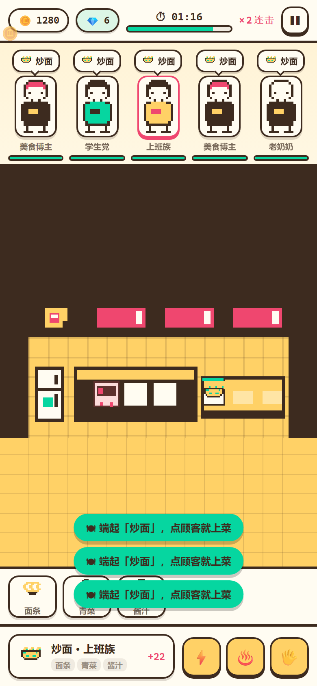
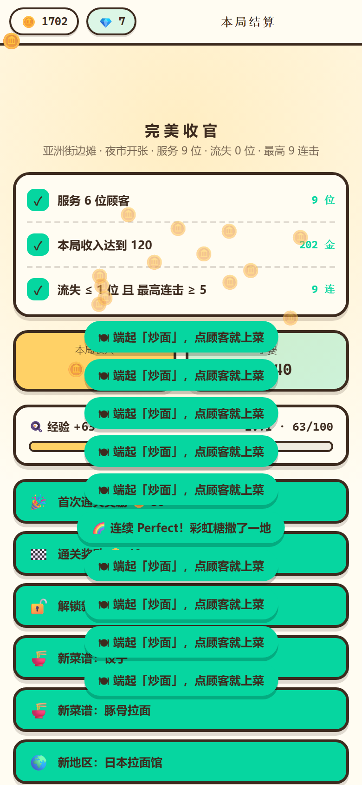
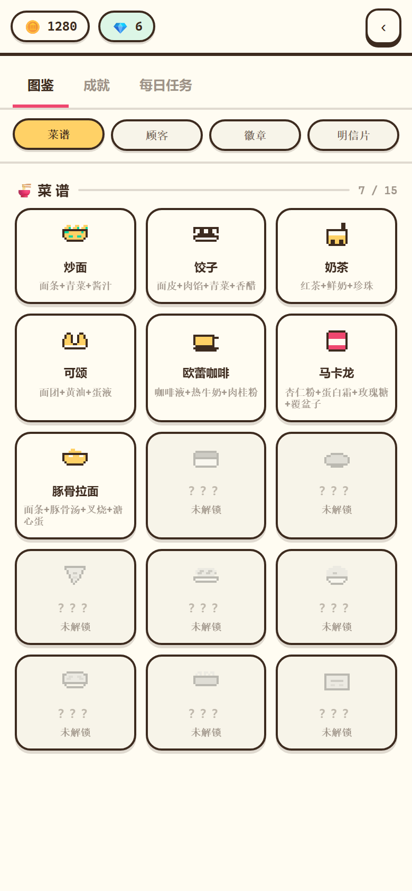
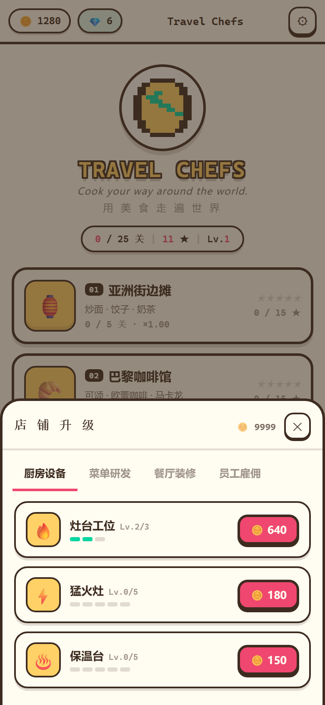

# Travel Chefs 🍳

> **Cook your way around the world** · 用美食走遍世界

一款像素风的「环游世界 + 模拟经营」网页小游戏：接待顾客 → 按配方备料 → 下锅出餐 → 装盘上菜 → 赚金币升级店铺 → 攒星星解锁下一个国家。

**零依赖、零构建、单文件**：整个游戏就是一个 `index.html`，双击即玩，也能直接丢到任意静态托管上。

- 🔗 **在线试玩**：<https://travel-chefs.vercel.app/> —— 手机浏览器打开即玩，进度存在浏览器本地
- 📦 **仓库地址**：<https://github.com/Miacy05/travel-chefs>

> 仓库已与 Vercel 连接：向 `main` 分支推送后会自动重新部署，改完 `index.html` 直接 push 即可上线。

---

## 游戏截图

以下全部是**真机视口（390×844 @2x）实拍**，不是设计稿：图里的顾客、锅里的火、出餐台上的菜，都是脚本通过游戏公开接口真玩出来的状态。

| 世界地图 | 营业中（核心循环） | 结算 |
| --- | --- | --- |
|  |  |  |
| 5 个地区 25 关，靠累计星星逐站解锁 | 顾客队列 · 食材台 · 灶台 · 三个道具 | 三条条件逐级判定，这里是 3 星通关 |

| 图鉴 | 店铺升级 |
| --- | --- |
|  |  |
| 菜品 / 食材 / 地区的收集进度 | 4 条升级线，全部用游戏内金币购买 |

---

## 一、怎么玩

### 完整操作链路

```
顾客进门 → 点食材（进备料区）→ 点灶台（开火烹饪）→ 出锅
        → 把菜拖到盘子（装盘，开始保鲜倒计时）→ 把盘子拖给顾客（上菜结算）
```

1. **世界地图**：一条环球航线，5 个国家/地区共 **25 个关卡**。第一站默认开放，之后靠累计星星解锁。
2. **选择关卡**：点地区进入关卡列表，看到每关的「目标条件」与已得星级。
3. **开始营业**：进入像素厨房。上方是顾客队列（含耐心条），中间是 160×90 的像素场景，下方是食材台与配方卡。
4. **出餐**：
   - 按配方把食材**逐个点进锅**（备料点齐即可，不要求顺序）；
   - 点灶台上的锅**开火**，等待烹饪进度条走完；
   - 把锅里的菜**拖到菜盘**完成装盘；
   - 把盘子**拖给对应顾客**完成上菜。
   - 上错菜、或顾客耐心耗尽离开，都会**清零连击**。
5. **结算**：时间到后按三条条件给出 1–3 星，首次通关额外奖励金币并解锁下一关。

### 三个道具（有冷却）

| 道具 | 冷却 | 效果 |
| --- | --- | --- |
| ⚡ 加速 | 30s | 当前锅的剩余烹饪时间 −50% |
| ♨️ 保温 | 45s | 最急的那位顾客耐心回复 50% |
| 🖐 上菜 | 60s | 把出餐台上最早做好的那道菜送给匹配的顾客 |

### 星级规则

三条条件**按顺序累计**——第 1 条不达标就停在那里，所以 3 星必须三项全达成：

| 星级 | 条件 |
| --- | --- |
| ★ | 服务够 N 位顾客 |
| ★★ | ★ 的条件 **且** 本局收入达标 |
| ★★★ | ★★ 的条件 **且** 顾客流失 ≤ 上限、最高连击 ≥ 下限 |

**0 星也能拿一半金币**（避免挫败感），但不解锁下一关。

### 金币与成长

```
单笔收入 = (菜品售价 + 小费) × (1 + 升级加成 + 装饰加成)
首次通关某关  额外 +80 金币
Perfect 上菜  出锅后 ≤ 烹饪时间 × 60% 内送达即可触发，小费更高并累积连击
```

经验按「出餐数 × 3 + 星级 × 8 + 关卡奖励」计算，升到下一级需要 `100 × 当前等级` 点经验。

---

## 二、5 个地区 · 25 个关卡 · 15 道菜

| # | 地区 | 解锁门槛 | 招牌菜 | 地区装饰 | 价格倍率 |
| --- | --- | --- | --- | --- | --- |
| 01 | 🏮 亚洲街边摊 | 默认开放 | 炒面 · 饺子 · 奶茶 | 红灯笼串 · 布幡 · 塑料凳 | ×1.00 |
| 02 | 🥐 巴黎咖啡馆 | 累计 6 ★ | 可颂 · 欧蕾咖啡 · 马卡龙 | 条纹遮阳篷 · 藤椅 · 铁塔摆件 | ×1.15 |
| 03 | 🍜 日本拉面馆 | 累计 14 ★ | 豚骨拉面 · 握寿司 · 抹茶 | 暖帘 · 招财猫 · 酱油瓶 | ×1.30 |
| 04 | 🍕 意大利披萨店 | 累计 22 ★ | 玛格丽特 · 肉酱意面 · 意式冰淇淋 | 砖砌烤炉 · 番茄藤 · 藤编酒篮 | ×1.45 |
| 05 | 🌮 墨西哥塔可摊 | 累计 30 ★ | 街头塔可 · 牛油果酱 · 芝士卷饼 | 剪纸彩旗 · 仙人掌 · 彩色陶罐 | ×1.60 |

每个地区都有 5 关，**难度曲线五区共用**，只有金币目标按价格倍率缩放，保证曲线可预期：

| 关 | 名称 | 时长 | 座位 | 上客间隔 | 可用菜数 | 1 星条件（服务 / 收入 / 流失 / 连击） |
| --- | --- | --- | --- | --- | --- | --- |
| 1 | 夜市开张 | 90s | 2 | 7.5s | 1 道 | 6 位 / 120 / ≤1 / ≥5 |
| 2 | 新菜上架 | 90s | 2 | 6.5s | 2 道 | 7 位 / 180 / ≤1 / ≥5 |
| 3 | 人气爆棚 | 100s | 2 | 6.0s | 3 道 | 8 位 / 240 / ≤1 / ≥6 |
| 4 | 晚高峰 | 110s | 3 | 5.2s | 3 道 | 10 位 / 320 / ≤2 / ≥8 |
| 5 | 美食节 | 120s | 3 | 4.6s | 3 道 | 12 位 / 420 / ≤2 / ≥10 |

> 表内收入目标是第 1 区（×1.00）的基准值。第 5 区 ×1.60，所以 E5 的收入目标是 672。

### 菜品参数

| 地区 | 菜 | 售价 | 基础小费 | 烹饪时长 | 配方步数 |
| --- | --- | --- | --- | --- | --- |
| 亚洲街边摊 | 炒面 | 18 | 4 | 3.0s | 3 |
| | 饺子 | 24 | 5 | 3.6s | 4 |
| | 奶茶 | 14 | 3 | 1.6s | 3 |
| 巴黎咖啡馆 | 可颂 | 21 | 4 | 2.6s | 3 |
| | 欧蕾咖啡 | 15 | 3 | 1.8s | 3 |
| | 马卡龙 | 25 | 5 | 3.2s | 4 |
| 日本拉面馆 | 豚骨拉面 | 24 | 5 | 4.2s | 4 |
| | 握寿司 | 22 | 5 | 2.2s | 3 |
| | 抹茶 | 13 | 3 | 1.4s | 3 |
| 意大利披萨店 | 玛格丽特 | 26 | 6 | 4.0s | 4 |
| | 肉酱意面 | 23 | 5 | 3.4s | 4 |
| | 意式冰淇淋 | 15 | 3 | 2.0s | 3 |
| 墨西哥塔可摊 | 街头塔可 | 18 | 4 | 2.4s | 3 |
| | 牛油果酱 | 13 | 3 | 1.6s | 3 |
| | 芝士卷饼 | 21 | 5 | 3.0s | 4 |

共 **45 种食材**，每种都是 16×16 的像素图形，由 5 色调色板现场合成。

### 5 种顾客

| 顾客 | 耐心 | 小费倍率 | 特点 |
| --- | --- | --- | --- |
| 上班族 | 24s | ×1.0 | 标准 |
| 学生党 | 18s | ×0.9 | 最急 |
| 美食博主 | 32s | ×1.6 | 高小费 |
| 老奶奶 | 40s | ×1.1 | 最耐心 |
| 小朋友 | 20s | ×1.2 | 急但给得多 |

---

## 三、店铺升级（4 条线）

| 分类 | 项目 | 满级 | 效果上限 |
| --- | --- | --- | --- |
| 🔥 厨房设备 | 灶台工位 | 3 → 4 个锅 | 同时开的锅更多 |
| | 猛火灶 | 5 级 | 烹饪提速 40% |
| | 保温台 | 5 级 | 装盘保鲜 +10s |
| 📖 菜单研发 | 加料台 | 3 级 | 每单小费 +3 |
| | 每道菜 · 菜单等级 | 5 级 | 该菜售价 +48%（15 道菜各一项） |
| 🪑 餐厅装修 | 加座 | 2 级 | 同时在场顾客 +2 |
| | 招牌灯箱 | 3 级 | 上客间隔 +1.2s |
| | 装饰布置 | 5 级 | 小费 +25% |
| 🧑‍🍳 员工雇佣 | 帮厨 | 3 级 | 每 3s 自动备料 1 步 |
| | 服务员 | 2 级 | 每 5.5s 自动上菜 1 次 |
| | 收银员 | 3 级 | 金币 +18% |

升级费用逐级递增（例如猛火灶 180 → 320 → 520 → 760 → 1100），全部用游戏内金币购买。

---

## 四、图鉴 / 成就 / 每日任务

- **图鉴**：记录已解锁的菜品、食材与地区，未解锁的显示为剪影。
- **成就（10 个）**：初来乍到 · 旅行家 · 完美主厨 · 收藏家 · 连击大师 · 财源滚滚 · 快刀手 · 五星好评 · 铁杆粉丝 · 彩蛋猎人，达成后发放金币或钻石。
- **每日任务**：从 6 个任务池里按日期稳定抽取 3 个，完成后领取奖励。

### 3 个彩蛋

| 彩蛋 | 触发方式 | 奖励 |
| --- | --- | --- |
| 🌏 地球仪 | 在地图上连点地球仪 10 次 | 50 金币（可反复触发） |
| 🌈 彩虹糖 | 单局连续 5 次 Perfect 上菜 | 彩虹特效 |
| 🐧 企鹅厨师 | 在厨房里连点冰箱 5 次 | 1 钻石（每局限一次） |

---

## 五、技术方案

### 单文件 + 模块命名空间

所有代码内联在一个 `index.html` 里，但**内部按模块切分成 IIFE**，统一挂在 `window.TC` 命名空间上：

```
TC.Util   → TC.DATA  → TC.Calc   → TC.Save   → TC.Upgrade
TC.Level  → TC.Daily → TC.Easter → TC.Ach    → TC.Pixel
TC.Scene  → TC.Audio → TC.UI     → TC.Router
```

**一条架构红线**：所有游戏规则写在纯函数模块里（`DATA / Calc / Save / Level / Upgrade / Daily / Easter / Ach`），
`Scene / UI / Audio` 只负责「画出来」和「把用户操作翻译成对逻辑层的调用」，自己不做任何规则判断。
这样约 90% 的规则代码都能被单元测试直接覆盖，而不需要靠截图回归。

### 像素渲染

- 场景用 **160×90 逻辑分辨率**，整数倍缩放 + 居中留白（letterbox），保证像素不糊。
- 全部图形由代码生成的**矩形列表**绘制，没有一张图片资源；`image-rendering: pixelated` 保证高分屏不糊。
- 严格 **5 色调色板**：暖黄 `#FFD166` / 番茄红 `#EF476F` / 薄荷绿 `#06D6A0` / 奶油白 `#FFFCF2` / 深棕 `#3D2B1F`。
  构建期有校验：最终输出不得出现第 6 种颜色。
- 每个地区自带 `floor / wall / accent` 配色，进入该地区时整站强调色一起切换。

### 音效

`TC.Audio` 用 **WebAudio 实时合成**（14 种音色全是振荡器 + 包络），不引入任何音频文件。
没有 `AudioContext` 的环境（如 Node/jsdom）会静默降级，绝不影响玩法。

### 存档

单一 `localStorage` key `travel-chefs:v2`，带版本号；读取时对每个字段做类型兜底，
写入用 `try/catch`（浏览器隐私模式下会抛）。换版本号即等于清档。**不需要任何数据库。**

---

## 六、单元测试

项目自带一套**零依赖测试框架**（不需要 jest / mocha），直接把 `index.html` 真实加载进 jsdom 跑：

```bash
node tests/run.js          # 跑全部
node tests/run.js calc     # 只跑文件名含 calc 的
node tests/run.js --list   # 列出所有测试文件
```

当前状态：**383 条断言 · 14 个测试文件 · 全部通过**。

| 测试文件 | 覆盖模块 |
| --- | --- |
| `ach.test.js` | 成就判定与领取 |
| `audio.test.js` | 音效合成、节流、无声环境降级 |
| `calc.test.js` | 价格、小费、星级、经验、结算 |
| `daily.test.js` | 每日任务抽取与进度 |
| `data.test.js` | 数据表自洽性（关卡/菜品/升级索引） |
| `easter.test.js` | 三个彩蛋 |
| `flow.test.js` | 端到端：开一关 → 做单 → 上菜 → 结算 → 解锁 |
| `level.test.js` | 关卡状态机（备料/烹饪/装盘/上菜/道具） |
| `pixel.test.js` | 像素图形生成与 5 色校验 |
| `router.test.js` | 视图路由与顶栏 |
| `save.test.js` | 存档读写、归一化、迁移 |
| `scene.test.js` | 布局、命中检测、绘制不变量 |
| `ui.test.js` | 页面渲染与事件翻译 |
| `upgrade.test.js` | 升级购买与数值读取 |

> 测试需要 `jsdom`。若本机没有，可在 `travel-chefs/` 下 `npm i -D jsdom`，或用环境变量
> `TC_JSDOM=<jsdom 绝对路径>` 指定。

---

## 七、文件结构

```
travel-chefs/
├── index.html          ← 整个游戏（结构 + 样式 + 全部逻辑，单文件，约 6200 行）
├── README.md           ← 本文件
├── LICENSE             ← MIT
├── .gitignore          ← 排除 backup-v1/（v1 原型存档）等
├── .vercelignore       ← 部署时排除 tests/ tools/，线上只留 index.html
├── docs/               ← README 里用到的游戏截图（390×844 @2x）
│   ├── map.png         cook.png      result.png
│   └── codex.png       upgrade.png
└── tests/
    ├── run.js          ← 测试入口
    ├── harness.js      ← 零依赖断言框架
    ├── helpers.js      ← jsdom 装载器
    └── *.test.js       ← 14 个测试文件
```

部署时只需保证 `index.html` 在仓库根目录即可。

---

## 八、部署

### 已经在线

当前版本已发布在 **<https://travel-chefs.vercel.app/>** —— 纯静态单文件，没有后端依赖，不需要登录。

仓库与 Vercel 已建立 Git 连接，**向 `main` 分支推送即自动重新部署**，无需手动操作。

### 部署方案（本项目实际采用的路径）

如果要把这套东西从头再来一遍，最省事的顺序是：先把仓库推上 GitHub，再让 Vercel 连这个仓库。

**第 1 步 · 推送到 GitHub**

先在 GitHub 网页端新建一个**空仓库**（不要勾选 *Add a README file*）。仓库名必须是 `travel-chefs` —— 它决定 Vercel 的域名。

然后在 `travel-chefs/` 目录下推送。本机到 `github.com:443` 的 HTTPS 通道实测不稳定（直连超时、
代理返回 502 / TLS 重置），因此这里走 **SSH over 443**：

```powershell
$git = "C:\Users\20742\.workbuddy\binaries\PortableGit\versions\1.2.0\cmd\git.exe"

& $git remote add origin ssh://git@ssh.github.com:443/<用户名>/travel-chefs.git
& $git config core.sshCommand "ssh -i <私钥路径> -o StrictHostKeyChecking=accept-new"
& $git push -u origin main
```

> **如果 SSH 也不通**：仓库里的 `tools/push-to-github.js` 是备用通道，走可达的
> `api.github.com` REST API 建仓库并生成同样的提交记录：
>
> ```powershell
> node tools/push-to-github.js
> ```
>
> 首次运行会提示粘贴一个 GitHub Token（生成地址 <https://github.com/settings/tokens>，
> 勾选 `repo` 权限即可），跑完直接输出仓库地址。Token 只用于这一次推送，建议用完后撤销。

**第 2 步 · Vercel 上线**

用命令行（本项目就是这个流程，`vercel` 会自动把仓库和项目关联起来）：

```powershell
npx vercel login          # 会给出一个设备码链接，浏览器点一下即可授权
npx vercel deploy --prod --yes
```

首次部署会自动创建名为 `travel-chefs` 的项目，并分配 **`https://travel-chefs.vercel.app`**；
同时把 GitHub 仓库连上，之后每次 push 都会自动重新部署。

也可以纯在网页上做：打开 [vercel.com](https://vercel.com) → **Continue with GitHub** →
**Add New Project** → 选中 `travel-chefs` → **Import** → Framework Preset 选 **Other**
（纯静态站，**不要**选 Next.js）→ Build Command / Output Directory **全部留空** → **Deploy**。

> 只要 `index.html` 在仓库根目录，Vercel 就会把它当入口页。`backup-v1/` 已被 `.gitignore`
> 排除在仓库之外；`.vercelignore` 另外把 `tests/`、`tools/` 排除在部署产物之外，
> 避免测试代码被静态托管公开暴露。

### 另一种托管 · 腾讯云 CloudBase（得到 `xxx.tcloudbaseapp.com`）

1. 打开 [腾讯云开发控制台](https://console.cloud.tencent.com/tcb) 并创建一个环境
2. 左侧进入 **静态网站托管** → **上传文件**
3. 把 `index.html` 上传到根目录
4. 在 **基础配置** 里即可看到分配的 `xxx.tcloudbaseapp.com` 访问域名

> 国内访问 `*.vercel.app` 可能偏慢，`*.tcloudbaseapp.com` 走国内节点会更稳。

### 验证标准

把网址发到手机微信，点开能正常进入地图、开始营业、完成一单，才算真的上线成功。

### 常见问题

| 情况 | 处理 |
| --- | --- |
| `git : 无法将"git"项识别为 cmdlet` | 本机没把 git 装进 PATH。WorkBuddy 自带便携版，直接用全路径调用：`& "C:\Users\20742\.workbuddy\binaries\PortableGit\versions\1.2.0\cmd\git.exe" ...`；或自行安装 [Git for Windows](https://git-scm.com/download/win) |
| `failed to push` | 检查 `git remote` 里的用户名是否写错 |
| `git push` 超时 / `TLS connection was reset` | 本机到 `github.com:443` 不通。改用 `node tools/push-to-github.js`（走可达的 `api.github.com`），或换网络 / 换代理节点后重试 |
| 提示分支名不是 `main` | 执行 `git branch -M main` 再 push |
| 部署后打开是 404 | 确认 `index.html` 在仓库根目录，Root Directory 留空 |
| 进度没保存 | 数据存在浏览器 `localStorage`，换设备或清缓存会重置（作业要求不碰数据库） |

---

## 九、本地预览

直接双击 `index.html` 即可；或起一个静态服务器：

```bash
python -m http.server 5173
# 然后访问 http://localhost:5173
```

---

## 十、已知限制

- 进度存在浏览器本地，**不做多端同步**（按课程要求不引入数据库）。
- 音效为程序合成，风格偏 8-bit，未接入真实音频素材。
- 目前可玩内容为 5 个地区 25 关；新增地区只需往 `TC.DATA.REGIONS` 里加一条数据，关卡会自动展开。

---

## 十一、许可证

[MIT](LICENSE)
